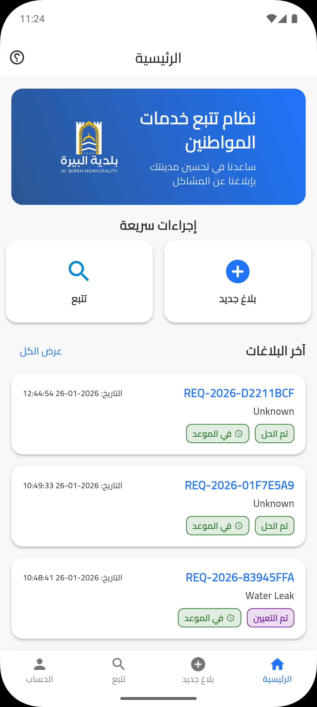
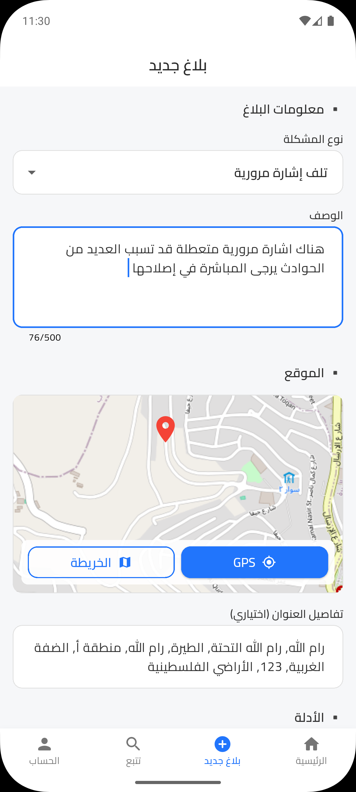
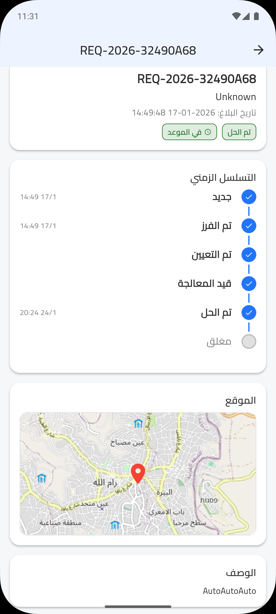
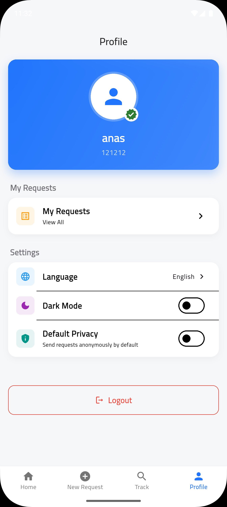

# Smart Municipal Complaint System

A full-stack smart municipal complaint platform that enables citizens to report public infrastructure and service issues through a cross-platform mobile application, while municipal staff and maintenance teams manage, monitor, and resolve complaints through dedicated web dashboards.

The system was designed to improve how municipalities receive, classify, assign, and track complaints in a smarter, faster, and more organized way.

---

## Overview

The **Smart Municipal Complaint System** is a digital platform built to modernize the complaint management process between citizens and municipalities.

Citizens can easily report real-world issues such as:

- Road potholes
- Water leaks
- Broken traffic lights
- Street damage
- Public service faults
- Other municipal maintenance issues

Using the mobile application, users can submit complaints with:
- Exact location using GPS or manual map selection
- Detailed problem description
- Uploaded photos and evidence
- Anonymous or identified submission option

Once submitted, the complaint is automatically processed by the backend, checked against existing reports to detect possible duplicates, and then assigned to the most suitable maintenance employee based on specialization, region, and current workload.

---

## Project Goals

This project aims to:

- Simplify complaint reporting for citizens
- Improve municipality response time
- Reduce duplicate reports
- Automate complaint assignment fairly
- Balance workload among maintenance staff
- Track complaint status transparently
- Provide municipalities with a smarter operational view of public issues

---

## Key Features

### Citizen Mobile App
- Submit municipal complaints quickly and easily
- Detect user location using GPS
- Allow manual location selection on the map
- Convert coordinates into detailed location names using APIs
- Attach photos and evidence to the complaint
- Submit complaints anonymously or with user identity
- Track complaint progress in real time
- Support Arabic and English languages
- Support Dark Mode and Light Mode
- Available for both Android and iOS

### Duplicate Complaint Detection
The system checks whether a newly submitted complaint is a duplicate by comparing it with previous complaints based on:
- Problem type
- Geographic proximity
- Time window
- Existing reports in the same area

This helps prevent redundant reports and improves complaint handling efficiency.

### Smart Auto-Assignment Engine
New complaints are automatically assigned to the most suitable maintenance employee using intelligent logic based on:
- Employee specialization
- Employee region / zone
- Current workload
- Number of active assigned complaints

This ensures fair load balancing and faster issue resolution.

### Municipal Staff Dashboard
Municipality staff can:
- View all incoming complaints
- Review and verify complaint assignments
- Monitor urgent or delayed complaints
- Add maintenance employees
- Add and manage service regions
- Track complaint progress across the system
- Analyze complaint distribution geographically

### Maintenance Staff Dashboard
Maintenance employees can:
- View assigned complaints
- Open complaint details
- Update complaint status
- Mark complaints as resolved
- Upload proof and evidence after completing the work

---

## Complaint Lifecycle

Each complaint moves through a clear status flow:

1. **New**
2. **Triaged**
3. **Assigned**
4. **In Progress**
5. **Resolved**
6. **Closed**

This gives both citizens and municipality staff full visibility into complaint progress.

---

## User Roles

### 1. Citizen
The citizen uses the mobile application to submit and track complaints.

### 2. Municipal Staff
Municipal staff review complaints, monitor operations, manage assignments, add regions, and manage maintenance staff.

### 3. Maintenance Employee
Maintenance employees receive assigned complaints, work on resolving them, and upload proof of completion.

---

## Heatmap and Active Map Monitoring

One of the key features of the staff dashboard is the **Active Complaint Heatmap**.

This map provides a visual representation of complaint density across different areas, helping municipal staff quickly identify:
- High-frequency complaint zones
- Problem concentration areas
- Regions requiring urgent intervention
- Patterns of repeated infrastructure failures

The heatmap transforms raw complaint data into an operational geographic view, allowing decision-makers to better prioritize resources and improve field response planning.

---

## Tech Stack

### Mobile Application
- **Flutter**
- Cross-platform support for **Android** and **iOS**

### Web Dashboards
- **React**

### Backend
- **FastAPI**

### Database
- **MongoDB**

### Additional Integrations
- GPS / Location Services
- Reverse Geocoding APIs
- Map APIs
- File/Image Upload Handling

---

## System Architecture

The project follows a full-stack architecture composed of:

- **Citizen Mobile App** for complaint submission and tracking
- **Municipal Staff Web Dashboard** for operational management
- **Maintenance Staff Web Dashboard** for field complaint handling
- **FastAPI Backend** for business logic, duplicate detection, auto-assignment, and status updates
- **MongoDB Database** for flexible complaint and user data storage

---

## Screenshots

## Citizen Mobile App

### Dashboard

  

### New Complaint

  

### Complaint Tracking

  

### Profile

  

---

## Municipal Staff Dashboard

### Dashboard

  

### Active Complaint Heatmap

  

### Add Maintenance Employee

  

---

## Maintenance Staff Dashboard

### Dashboard

  

### Assigned Complaints

  

### Complaint Details and Evidence Upload

  

---

## Why This Project Matters

Municipal complaint handling is often slow, manual, and difficult to monitor. This project introduces a smarter and more transparent workflow by combining:
- citizen-friendly reporting,
- automated operational decision-making,
- fair task distribution,
- geographic analysis,
- and real-time status tracking.

It helps municipalities move from reactive complaint handling to a more organized and data-driven service model.

---

## Future Enhancements

Possible future improvements include:
- Push notifications for complaint updates
- SLA monitoring and escalation rules
- Advanced analytics dashboard
- Complaint priority prediction using AI
- Photo-based issue classification
- Integration with municipal GIS systems
- Internal staff performance reports

---

## Repository Showcase Note

This repository is presented as a showcase of the project’s system design, features, and interfaces. Screenshots are included to demonstrate the implemented workflows across the citizen app, municipal staff dashboard, and maintenance staff dashboard.

---

## Authors

Developed as a smart municipal digital transformation project for complaint reporting, field maintenance coordination, and public service monitoring.
