# Smart Municipal Complaint System 🏙️

<p>
  
</p>

---

<p align="center">


</p>

---

# 📌 Overview

**Smart Municipal Complaint System** is a full-stack digital platform designed to modernize how municipalities receive, process, assign, and resolve public service complaints.

The platform enables citizens to report infrastructure and municipal service issues through a **cross-platform mobile application**, while municipality admins and staff manage operations through **web dashboards**.

The system helps municipalities move from slow manual complaint handling to a smarter, more organized, and transparent workflow.

---

# ⚠ Project Notice

This repository is a **portfolio showcase only**.

The source code is not publicly shared in this repository. This showcase is intended to present:

- Project idea
- Core features
- System architecture
- Technology stack
- Screenshots of the implemented system

---

# 🏗 System Architecture

```
Citizens
   │
   └── Flutter Mobile App
          │
          ▼
      FastAPI Backend
          │
          ▼
      MongoDB Database
          │
    ┌─────┴─────────────┐
    │                   │
    ▼                   ▼
Admin Municipality   Municipal Staff Dashboard
      (React)               (React)
```

---

# 🛠 Tech Stack

## Mobile Application
- Flutter
- Cross-platform support for Android and iOS
- GPS / Location Services
- Map APIs
- Reverse Geocoding APIs
- Image upload support

## Web Dashboards
- React.js
- Responsive dashboards
- Complaint monitoring and management tools

## Backend
- FastAPI
- Duplicate complaint detection
- Smart auto-assignment engine
- Complaint lifecycle management

## Database
- MongoDB
- Flexible document-based storage

---

# 🚀 Core Features

## Citizen Mobile Application

- Submit complaints quickly and easily
- Report issues such as:
  - Road potholes
  - Water leaks
  - Broken traffic lights
  - Street damage
  - Public infrastructure faults
- Detect exact location using GPS
- Select location manually on the map
- Upload photos and evidence
- Submit complaints anonymously or with user identity
- Track complaint progress in real time
- Arabic and English language support
- Dark mode and light mode

---

## Duplicate Complaint Detection

The system automatically detects duplicate complaints by comparing:

- Problem type
- Location proximity
- Time window
- Existing complaints in the same area

This prevents redundant reports and improves system efficiency.

---

## Smart Auto-Assignment Engine

Complaints are automatically assigned to the most suitable employee based on:

- Specialization
- Region / zone
- Current workload
- Number of assigned complaints

This ensures fair distribution of work among staff.

---

# 👥 User Roles

## Citizen
Reports complaints through the mobile application and tracks their status.

## Admin Municipality
Manages the overall complaint system, monitors reports, manages regions, and supervises operations.

## Municipal Staff
Receives assigned complaints, updates status, resolves issues, and uploads proof of resolution.

---

# 🔄 Complaint Lifecycle

Each complaint follows a clear workflow:

1. **New**
2. **Triaged**
3. **Assigned**
4. **In Progress**
5. **Resolved**
6. **Closed**

---

# 🗺 Active Complaint Heatmap

The municipality dashboard includes a **complaint heatmap** showing geographic complaint density.

This allows municipalities to identify:

- High complaint zones
- Infrastructure problem clusters
- Areas requiring urgent attention
- Patterns of repeated issues

The heatmap converts raw complaint data into actionable geographic insights.

---

# 🖼 System Screenshots

## Citizen Mobile Application

<p align="center">
  
  
  
  
</p>

---

## Admin Municipality Dashboard

<p align="center">
  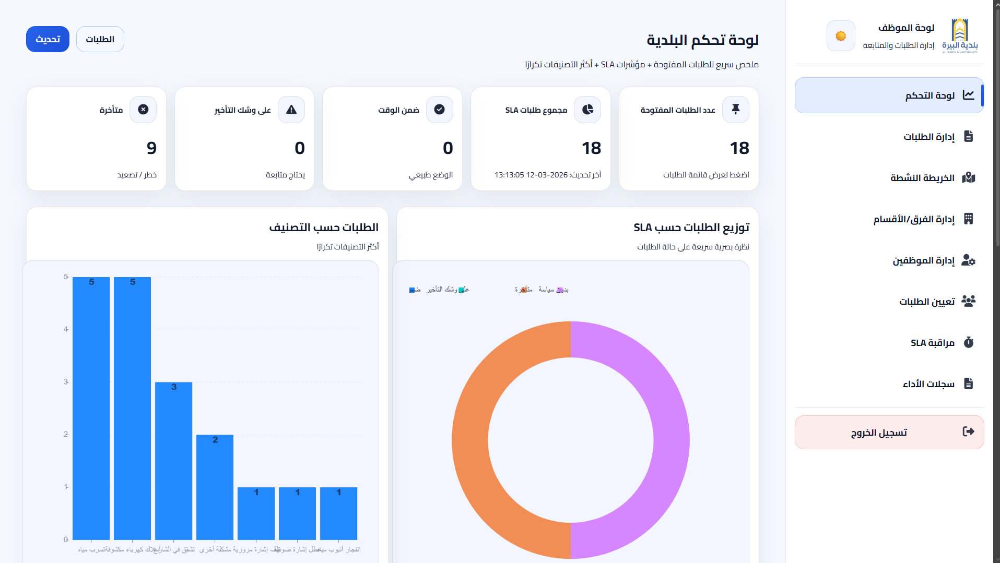
  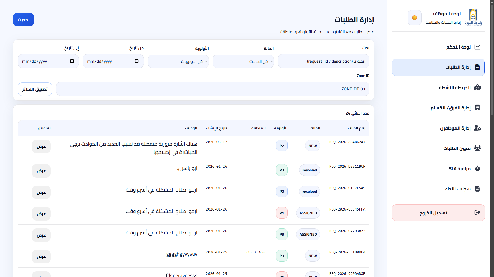
  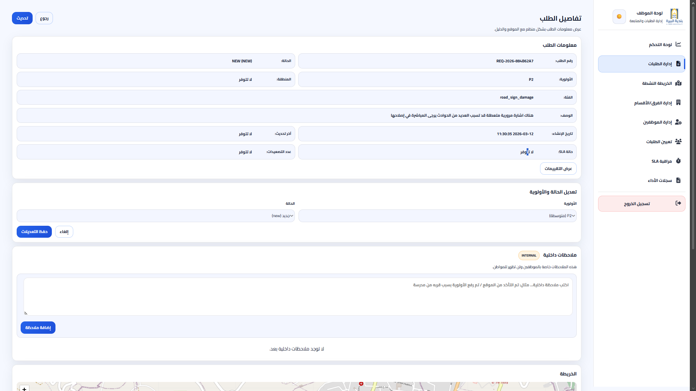
  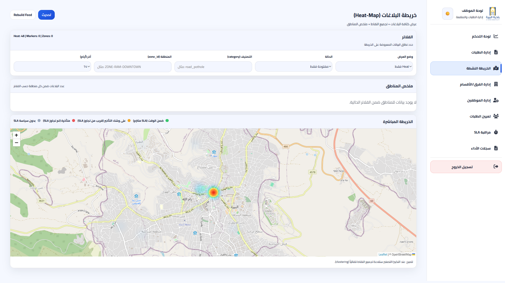
  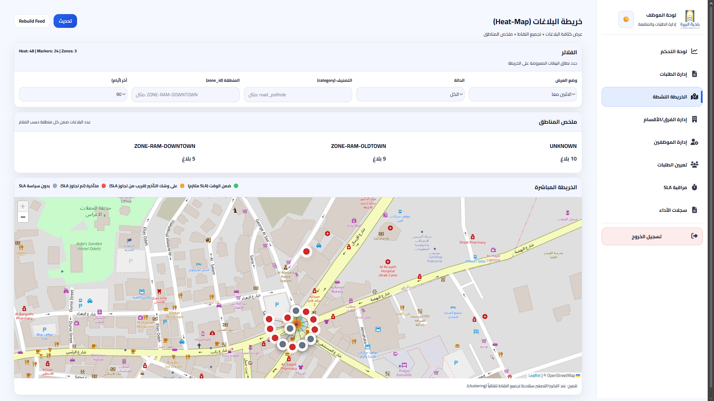
  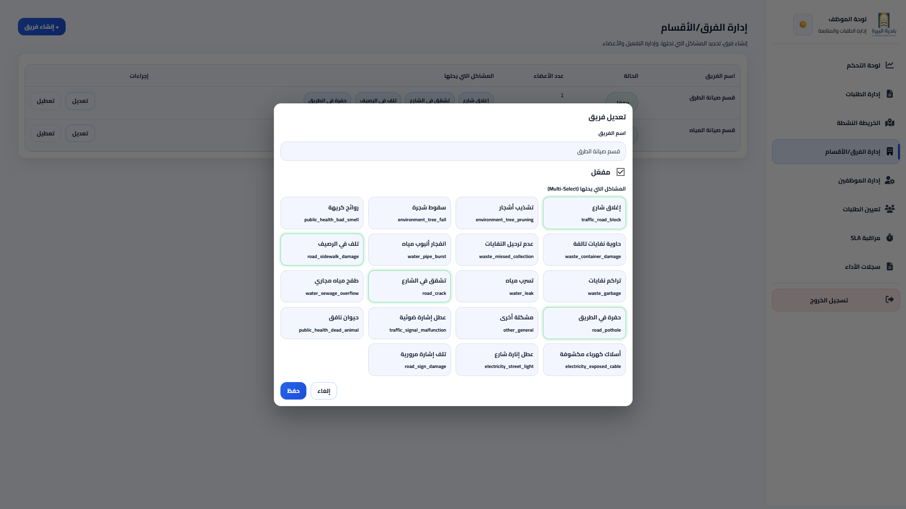
  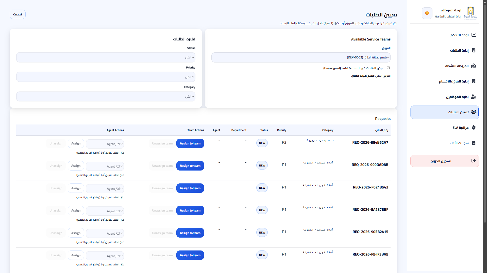
  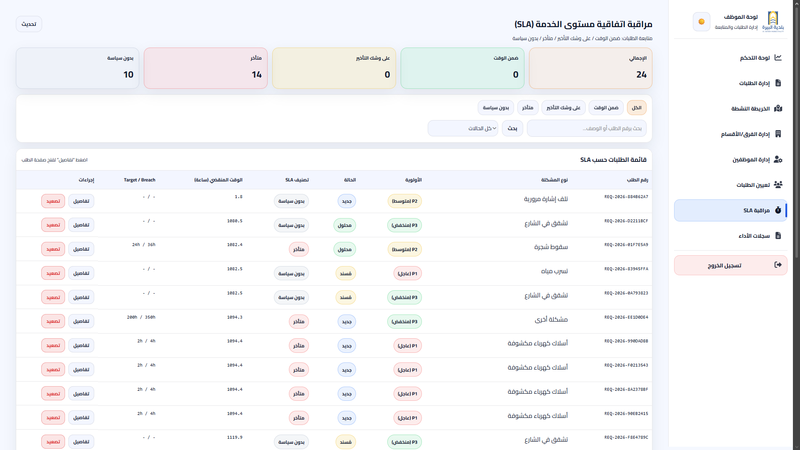
  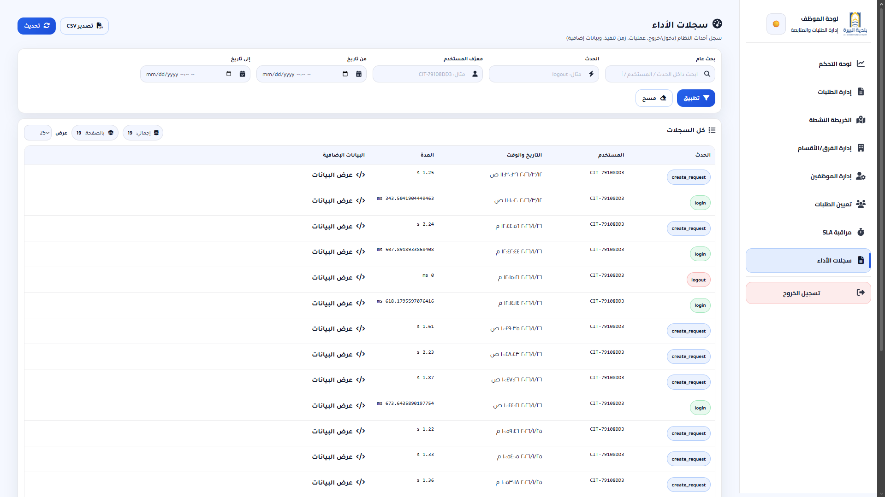
</p>

---

## Municipal Staff Dashboard

<p align="center">
  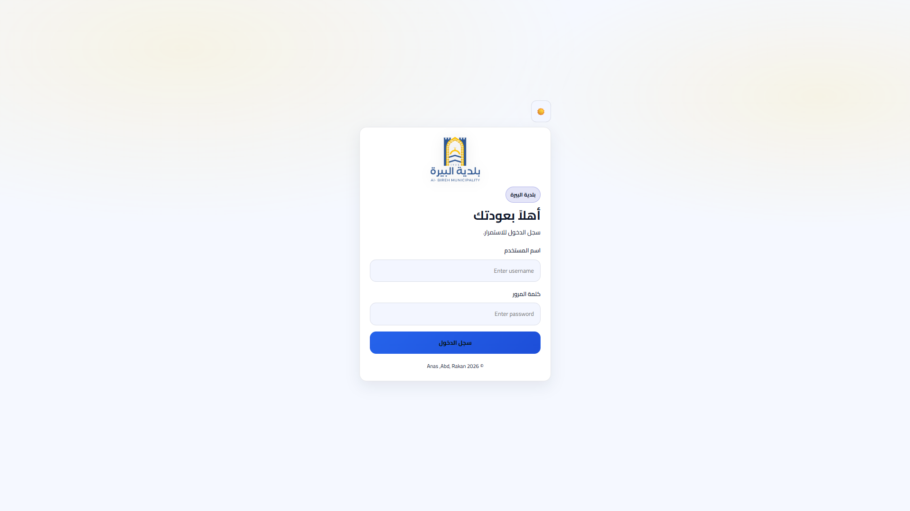
  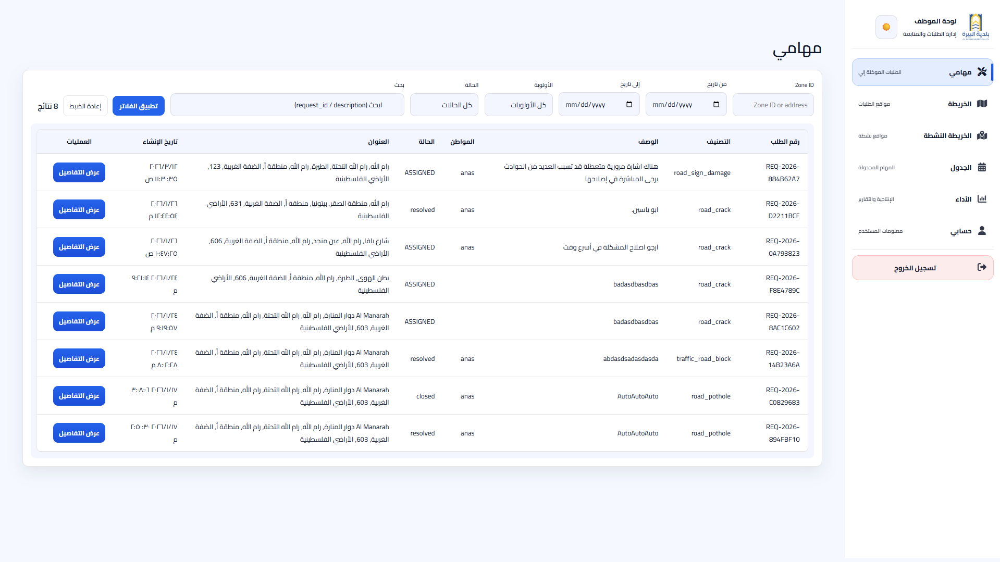
  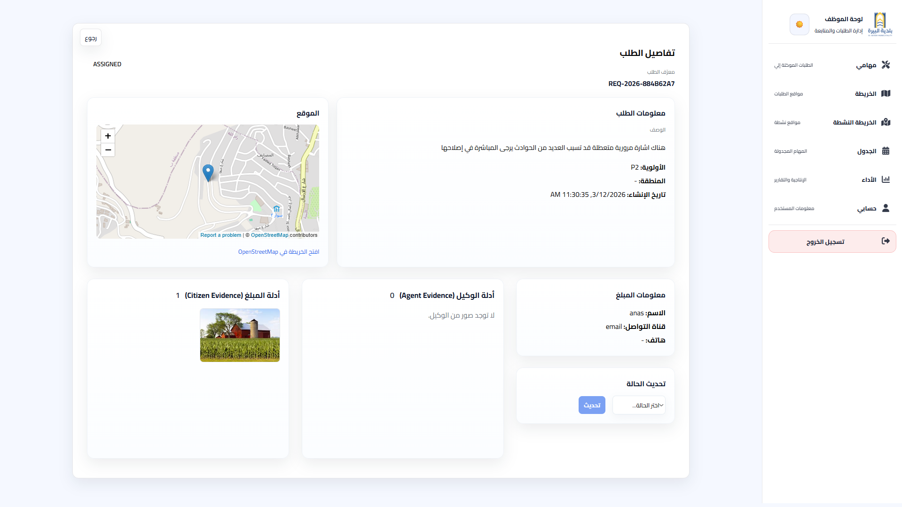
  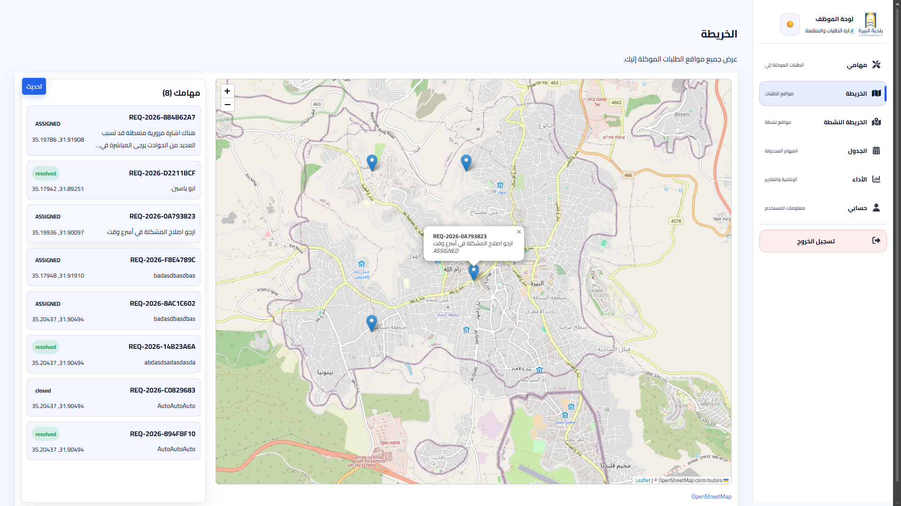
  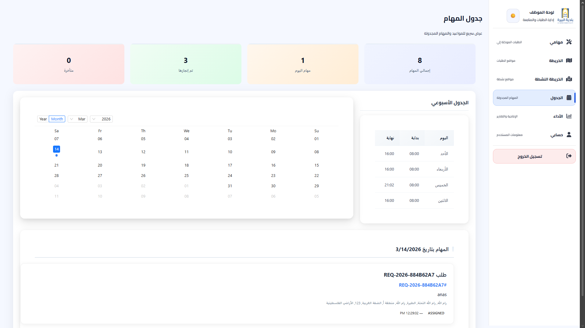
  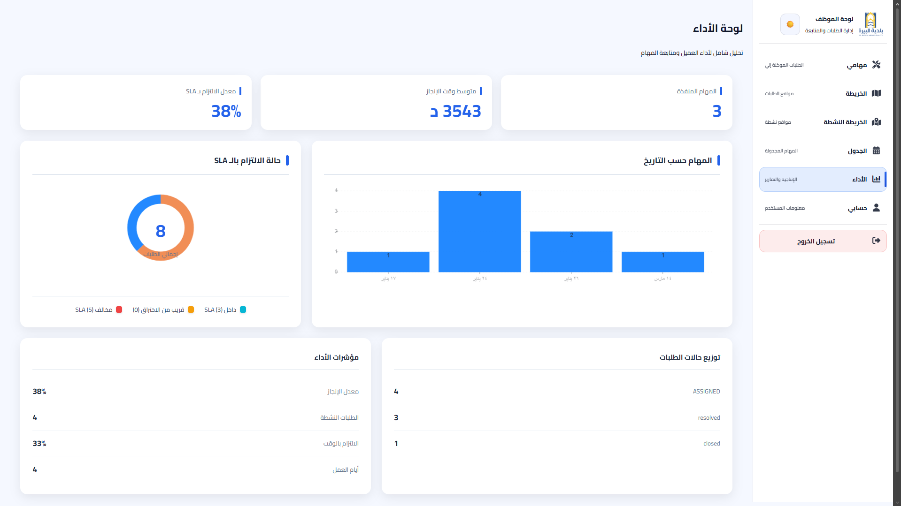
  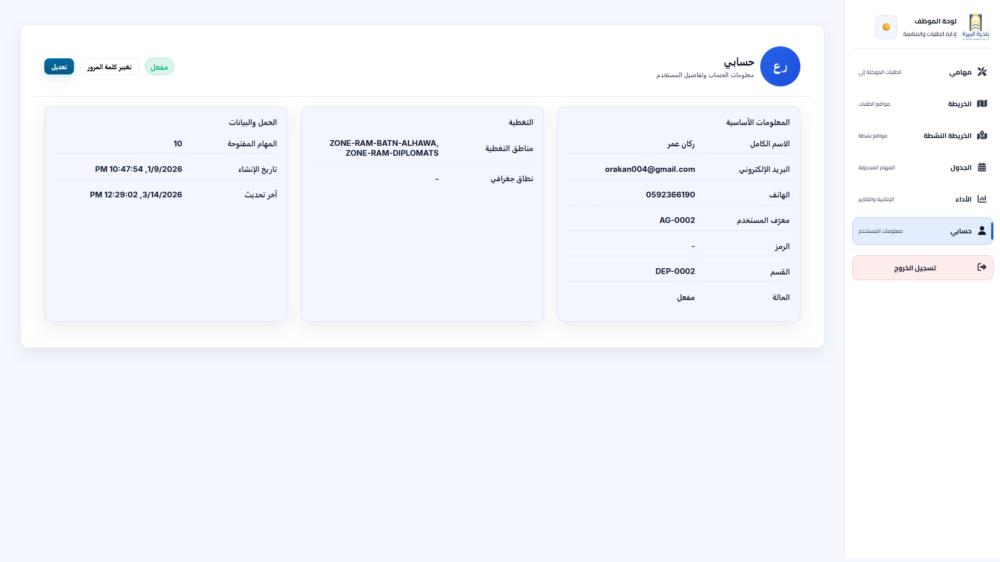
</p>

---

# 📊 Project Highlights

✔ Cross-platform mobile application  
✔ Municipality admin dashboard  
✔ Municipality staff dashboard  
✔ Smart duplicate complaint detection  
✔ Auto-assignment engine  
✔ Complaint lifecycle tracking  
✔ Map-based complaint reporting  
✔ Heatmap-based monitoring  

---


# 📝 Repository Showcase Note

This repository is presented as a **project showcase** demonstrating the system architecture, features, and user interfaces of the Smart Municipal Complaint System.

---

# 👨‍💻 Developed By

- Anas Al Sayed
- Abd Al-rheem Yaseen
- Rakan Omar
